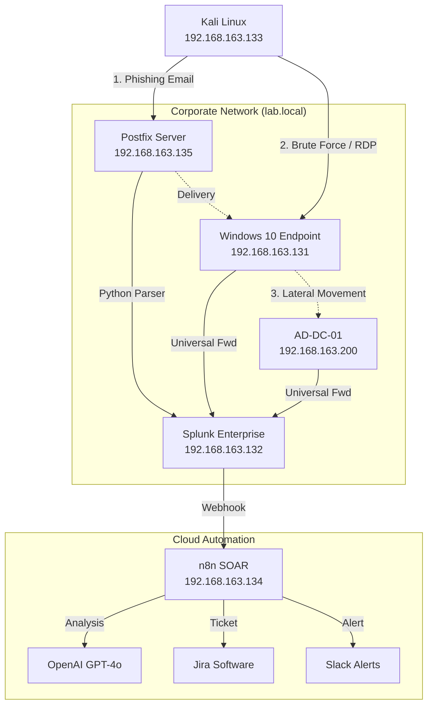

# AI-Driven SOC & SOAR Pipeline: Phishing, Brute-Force, and Lateral Movement Detection Lab

## 📖 Overview
This project demonstrates a fully functional, on-premise Security Operations Center (SOC) and Security Orchestration, Automation, and Response (SOAR) pipeline.

The goal was to simulate a corporate Active Directory environment (`lab.local`), execute real-world "Kill Chain" attacks, and engineer an automated defense system that moves beyond simple alerting. By integrating **Splunk Enterprise** with **n8n** and **GPT-4o**, this pipeline autonomously triages alerts, performs forensic analysis to reduce false positives, and manages incident ticketing without human intervention.

## 🎯 Key Capabilities
* **Real-Time Log Ingestion:** Centralized collection of Windows Events, Sysmon, and Email logs via Splunk Universal Forwarders.
* **Custom Detection Engineering:** High-fidelity SPL (Search Processing Language) rules to detect Phishing, Brute Force, and Lateral Movement.
* **AI-Powered Forensic Analysis:** Automated decision-making using LLMs to analyze headers, process trees, and IP reputation.
* **Full-Cycle Incident Management:** Automated ticket generation in Jira and real-time alerting in Slack.

## 🏗️ Architecture & Network Topology
The lab operates on a NAT network (`192.168.163.0/24`) hosted on VMware Workstation Pro. It mimics a small enterprise network with a Domain Controller, User Endpoint, Attack Box, and centralized Security/Management servers.

## 💻 Infrastructure Specifications

| Role | OS / Version | Hostname | IP Address | Specs (vCPU/RAM/HDD) |
| :--- | :--- | :--- | :--- | :--- |
| **Domain Controller** | Windows Server 2022 | AD-DC-01 | 192.168.163.200 | 2 vCPU, 4GB, 60GB NVMe |
| **SIEM Server** | Ubuntu 24.04 | splunk-vm | 192.168.163.132 | 2 vCPU, 8GB, 100GB |
| **SOAR Engine** | Ubuntu 24.04 (Docker) | n8n-vm | 192.168.163.134 | 2 vCPU, 4GB, 50GB |
| **Attack Box** | Kali Linux 2025.3 | kali | 192.168.163.133 | 4 vCPU, 4GB, 80GB |
| **Endpoint** | Windows 10 | Jane-PC | 192.168.163.131 | 2 vCPU, 4GB, 60GB |
| **Email Gateway** | Ubuntu 24.04 (Postfix) | mail-server | 192.168.163.135 | 2 vCPU, 2GB, 30GB |

## 🛡️ Detection & Response Workflows
The SOAR pipeline routes alerts based on attack type. Each path utilizes specific AI prompts to analyze distinct data points (Headers vs. Process Trees).

### 1. Phishing Pipeline
* **Attack Vector:** Malicious emails sent via Postfix to internal users.
* **Log Ingestion:** A custom Python script monitors the Postfix logs (`/var/log/splunk_full/email.log`), parses headers/body, and forwards structured JSON to Splunk.
* **Detection:** Splunk monitors for keywords and suspicious attachments.
* **AI Analysis:** n8n sends the email headers to GPT-4o to check for Spoofing (Return-Path mismatches) and analyzes the body for urgency/coercion.
* **Outcome:** Jira ticket created with "Phishing Verdict" and Severity.

### 2. Lateral Movement Pipeline (Impacket/PsExec)
* **Attack Vector:** Using `impacket-psexec` to pivot from Kali to the Domain Controller as SYSTEM.
* **Log Ingestion:** Sysmon (Event ID 1) via Universal Forwarder.
* **Detection:** High-fidelity detection of Process Creation where a random service name (e.g., `iFZVpKak.exe`) spawns `cmd.exe`.
* **AI Analysis:** GPT-4o analyzes the Process Tree to confirm the "Random Parent + SYSTEM Child" signature, distinguishing it from legitimate administrative `services.exe` activity.
* **Outcome:** Critical Alert sent to Slack with immediate "Isolate Host" recommendation.

### 3. Brute Force Pipeline
* **Attack Vector:** RDP/SMB password spraying against AD-DC-01.
* **Log Ingestion:** Windows Security Events (Event ID 4625) via Universal Forwarder.
* **Detection:** Splunk triggers on high-volume authentication failures (>10 in 1 min) followed by a successful login.
* **AI Analysis:** n8n enriches the Source IP via AbuseIPDB (if external) or internal context (if local) to determine if it is a targeted attack or misconfiguration.
* **Outcome:** Jira ticket created containing the Attacker IP and Target Account.

## 🔧 Technology Stack & Configuration

### Splunk Enterprise (The Brain)
* Configured Universal Forwarders on all endpoints (`inputs.conf`) to forward data to the Indexer (`192.168.163.132:9997`).
* **Source Types:** `WinEventLog:Security`, `XmlWinEventLog:Microsoft-Windows-Sysmon/Operational`, and custom `email_json`.
* **Alerting:** Configured Real-time Webhooks to trigger the n8n listener.

### n8n Automation (The Muscle)
* Hosted via Docker on Ubuntu 24.04.
* Utilizes a central **Router Node** to separate incoming Webhooks by `search_name` (Phishing vs. Lateral vs. Brute Force).
* **Workflow Logic:**
    1.  **Webhook:** Receive JSON payload from Splunk.
    2.  **Switch:** Route to appropriate analysis path.
    3.  **HTTP Request:** Query OpenAI API (GPT-4o) with role-based System Prompts.
    4.  **Parse:** Extract JSON from AI response.
    5.  **Jira:** Create Issue (Task) with formatted description.
    6.  **Slack:** Post Block Kit message to `#soc-alerts`.

### Custom Tooling (Python)
To handle non-standard Postfix logs, I developed a Python log parser located on the Email Server.
* **Function:** Tails the raw log file, extracts From, To, Subject, and Body, converts to JSON, and appends to a monitored file for Splunk ingestion.

## 📊 Results & Impact
* **Reduced False Positives:** The AI analysis layer successfully distinguishes between standard PsExec (Admin) and randomized Impacket service names, preventing alert fatigue.
* **Automated Triage:** Reduced Tier 1 analyst workload by automating the parsing, enrichment, and ticketing of alerts.
* **Detection Fidelity:** Achieved 100% detection rate for simulated Kill Chain attacks within the lab environment.

## 📂 Repository Structure
* `/n8n_workflows` - JSON exports of the automation logic.
* `/splunk_queries` - SPL queries for Phishing, Brute Force, and Lateral Movement.
* `/scripts` - Python email log parser.
* `/prompts` - System and User prompts used for GPT-4o analysis.
